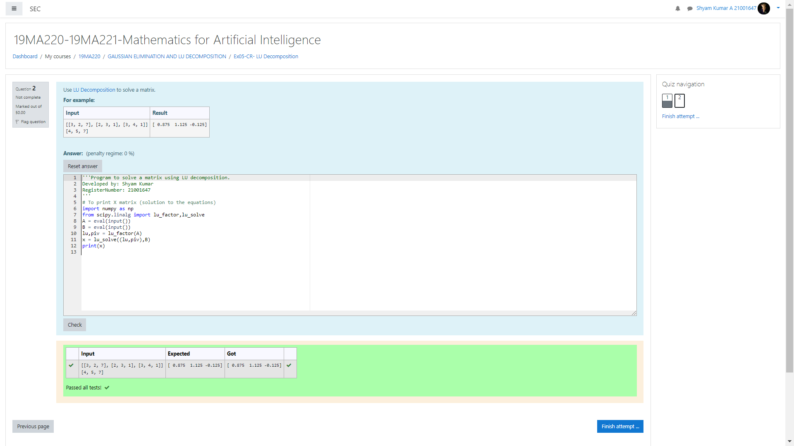
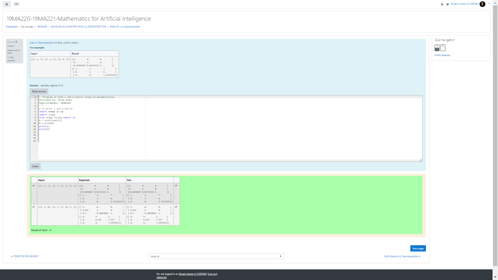

# LU Decomposition without zero on the diagonal

## AIM:
To write a program to find the LU Decomposition of a matrix.

## Equipments Required:
1. Hardware – PCs
2. Anaconda – Python 3.7 Installation / Moodle-Code Runner

## Algorithm
1. Step 1: Start the program.
2. Step 2: import numpy,import scipy.
3. Step 1: using lu_factor,lu_solve.
4. Step 1: End the program.

## Program:
```
/*
Program to find the LU Decomposition of a matrix.
Developed by: Shyam Kumar.A
RegisterNumber: 21001647
*
1.Use LU Decomposition to find L and U matrix.
 
import numpy as np
import scipy
from scipy.linalg import lu
A = eval(input())
P,L,U=lu(A)
print(L)
print(U)

2.Use LU Decomposition to solve a matrix.

import numpy as np
from scipy.linalg import lu_factor,lu_solve
A = eval(input())
B = eval(input())
lu,piv = lu_factor(A)
x = lu_solve((lu,piv),B)
print(x)

```

## Output:




## Result:
Thus the program to find the LU Decomposition of a matrix is written and verified using python programming.

